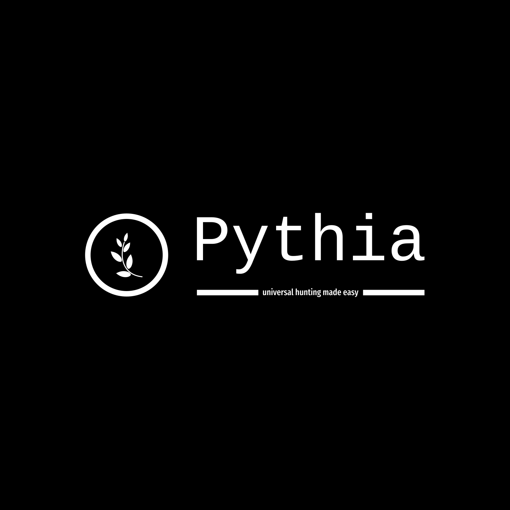
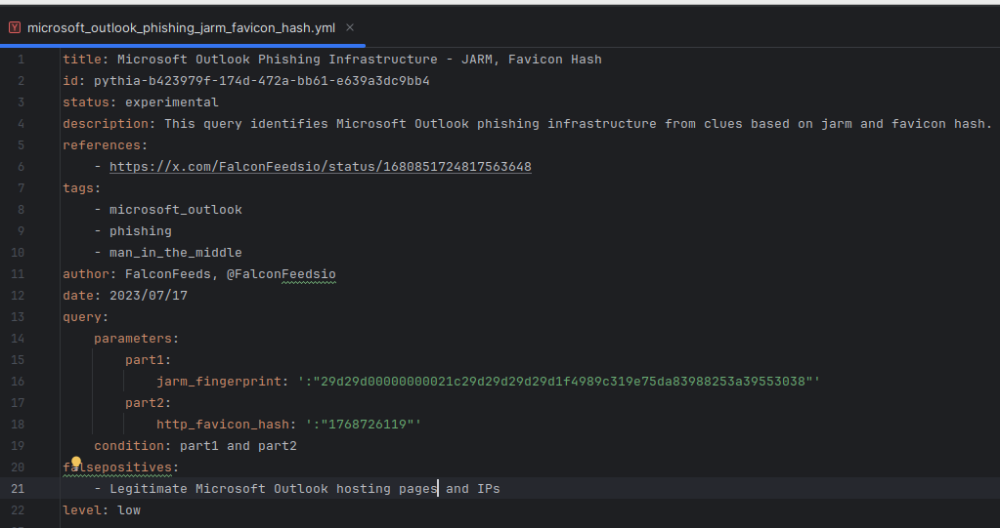
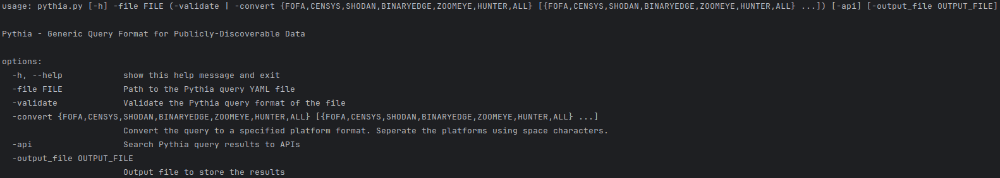

# Pythia - Generic Query Format for Discovering Malicious Infrastructure

<p align="center">
<br />
<picture>
  
</picture>
</p>
<br />

## What is Pythia
Welcome to the Pythia main query repository. The place where threat hunters and cybersecurity researchers collaborate on malware/threat actor infrastructure hunting.

Pythia offers a generic standardized query format (pretty similar to, and inspired from [Sigma](https://github.com/SigmaHQ/sigma)) that is easily convertable to multiple infrastructure hunting platforms. Such platforms are designed to scan daily (at different frequencies) multiple IP ranges and collect data (snapshots of a state in time). An important tip is to validate your findings with multiple tools to verify your results and even get more up-to-date results. That's why Pythia was developed.

Named after the legendary Oracle of Delphi in Greek mythology, Pythia is a versatile tool designed to translate and adapt search queries across multiple cybersecurity platforms. Just as the ancient Pythia provided insights and prophecies to seekers from diverse backgrounds, this modern tool delivers precise and actionable intelligence by converting a standard query format into the specific syntax required by various search engines. Pythia streamlines the process of querying multiple data sources, making it an indispensable asset for cybersecurity professionals seeking comprehensive network visibility and threat intelligence.

Pythia aims to be for publicly-discoverable data, what [Snort](https://www.snort.org/) is for network files, [YARA](https://github.com/VirusTotal/yara) is for files and [Sigma](https://github.com/SigmaHQ/sigma) is for log files.

**Don't judge, we are still in Beta! Feel free to contribute!**

## Why Pythia
Today, IoCs (Indicators of Compromise) are starting to fade away as their lifespan is decreasing. Cybercriminals no longer reuse the same infrastructure, making it difficult for traditional detection methods to keep up. Instead, the new trend is IoFA (Indicators of Future Attacks), where threat actors deploy multiple infrastructure in automated ways. The job of security researchers now involves fingerprinting these assets and searching for them on platforms like Shodan, Censys, FOFA and others to detect them before they are actively used by threat actors for their malicious campaigns.

Pythia supports this modern approach by providing a common format and easy conversions into multiple platform formats. This enables researchers to validate and enrich their findings efficiently, staying ahead of cyber threats by identifying and mitigating potential attacks before they occur.

## Pythia Integrations Included
- [Shodan](https://www.shodan.io/)
- [Censys](https://censys.com/)
- [FOFA](https://en.fofa.info/)
- [BinaryEdge](https://app.binaryedge.io/login)
- [ZoomEye](https://www.zoomeye.hk)
- [Hunter](https://hunter.how/)

## Analyzing Pythia Query Format

- **title**: A short capitalised title describing the query in high-level.
- **id**: A unique Pythia id. The id starts with "pythia-" and is supplemented a uuid (you can generate one from here: https://www.uuidgenerator.net/version4).
- **status**: The status of the query (experimental, test, or stable).
- **description**: The description of the query. Here are the details of the query such as the malware/threat actor infrastructure trying to identify, along with the specific fingerprints.
- **references**: Any references as URL for further information.
- **tags**: Any tags, useful for clustering the queries.
- **author**: The author of the query (i.e. FirstName Lastname, @twitter_name)
- **date**: The date the query was created.
- **query**: The query part consists of two sections: the **parameters**, where it consists of _parts_ (part1, part2, .., partN) and the **condition**. For the parameters section, each part is basically a _field_-_value_ pairing. The _field_ must be one of them that Pythia allows (you can find them in the mappings folders). The _values_ of each field may be the ones that someone used in the original platform that run the query. Attention here to also include the operator (i.e. : or =). Lastly, there is the **condition** section where the parts unite in logic, which includes them using logical operators (again found in mappings folder). For more information on how to structure your Pythia queries read [Query_Creation_Guide](documentation/Query_Creation_Guide.md).  
- **falsepositives**: Any potential false positives generated by the query.
- **level**: The level of confidence for successfully identifying the true positives. Values include: low, moderate and high.


## How does Pythia Conversions Works

Pythia includes 1-1 mappings with each of the supported platforms. These mappings are in fact strings in a dictionary. Those strings are searched using regular expressions, inside the condition field of the Pythia query, and if any hit is identified, the convertors perform string substitutions with the value of each platform's mappings.

Example conversion fields(substitutions: jarm_fingerprint, :, and, http_favicon,:):
- Pythia query (the condition part):
`jarm_fingerprint:"29d29d00000000021c29d29d29d29d1f4989c319e75da83988253a39553038" and http_favicon_hash:"1768726119"`

- FOFA query (converted result):
`jarm="29d29d00000000021c29d29d29d29d1f4989c319e75da83988253a39553038" && icon_hash="1768726119"`

## Key Features
1. Standardized format
2. Validator scripts
3. Convertor scripts to any of the supported platforms
4. Directly searching the converted queries into the platforms using APIs
5. Shared location to store infrastructure hunting queries

## Roadmap
1. Create abstract format ✅
2. Create validator script ✅
2. Create mappings for each platform ✅
3. Create script that converts the queries ✅
4. Add API integration for searching directly into the platforms✅
5. Expand mappings 🔜
6. Store more queries 🔜

## Query Creation
Please refer to [Query_Creation_Guide.md](documentation/Query_Creation_Guide.md)

## Contributing & Collaboration
Please refer to [CONTRIBUTING.md](CONTRIBUTING.md).

If you are interested in collaboration please reach out:
- [Efstratios Lontzetidis](https://www.linkedin.com/in/efstratioslontzetidis/) or [@lontze7](https://x.com/lontze7)

## Query Usage and Conversion
CLI Usage


Installation:
1. Clone and Move to the Repository
```bash
git clone https://github.com/EfstratiosLontzetidis/pythia.git
cd pythia
```
2. Optional: Set Up a Virtual Environment
```bash
python3 -m venv venv
source venv/bin/activate 
```
3. Install Dependencies
```bash
pip install -r requirements.txt
```

4. Start using Pythia! There are queries stored in the queries folder for testing or usage.

Usage Examples:

-Validate Pythia query:

```bash
python3 pythia.py -file queries/TOOLS/mythic_c2_favicon_hash_dec_or_title.yml  -validate
```

-Convert Pythia query to a specified platform's format

```bash
python3 pythia.py -file queries/TOOLS/mythic_c2_favicon_hash_dec_or_title.yml  -convert CENSYS
```

Convert Pythia query to a specified platform's format and search its API for results (you must supplement the API credentials in config/api_configs.py)

```bash
python3 pythia.py -file queries/TOOLS/mythic_c2_favicon_hash_dec_or_title.yml  -convert BINARYEDGE -api
```

-Convert Pythia query to a specified platform's format and search its API for results and save them in a file

```bash
python3 pythia.py -file queries/TOOLS/mythic_c2_favicon_hash_dec_or_title.yml  -convert FOFA -api -output_file apt_28_results.txt
```

## Example Use Cases:
- [Discovering Meduza Stealer Infrastructure with Pythia](https://medium.com/@s.lontzetidis/8956876cc15a)

## Resources & Further Reading on Hunting Malicious Infrastructure
- [Hunting Adversary Infrastructure Course - Intel-Ops](https://academy.intel-ops.io/courses/hunting-adversary-infra)
- [Will Thomas Blog](https://blog.bushidotoken.net/)
- [Intel-Ops Blog](https://medium.com/@Intel_Ops)
- [Embee Research Blog](https://www.embeeresearch.io/tag/intel/)
- [Censys Blog](https://censys.com/category/blog/)
- [Pivot Atlas](https://gopivot.ing/)

## ❗ Limitations
- Pythia works with manual mappings. It's important to be validated to ensure accurate and up-to-date mappings.
- Not all field mappings are included as Pythia is still in Beta.
- Pythia works with string substitutions, thus it may be prone to wrong parts converted. Manual intervention may be required.
- Complex queries do not work well with pythia at the moment.

## Maintainers
- [Efstratios Lontzetidis (@lontze7)](https://x.com/lontze7)

## Credits
In this section we will include every contributor in any type of assistance. We expect Pythia to grow from the help of the great CTI community. We are very grateful for any kind of help from contributing to the project, to adding/updating Pythia queries.