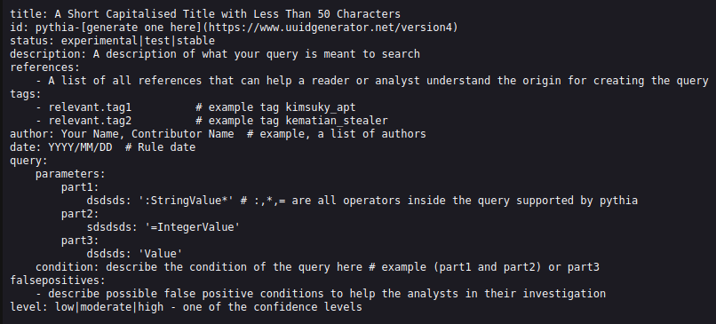

## Analyzing Pythia Query Format

- **title**: A short capitalised title describing the query in high-level.
- **id**: A unique Pythia id. The id starts with "pythia-" and is supplemented a uuid (you can generate one from here: https://www.uuidgenerator.net/version4).
- **status**: The status of the query (experimental, test, or stable).
- **description**: The description of the query. Here are the details of the query such as the malware/threat actor infrastructure trying to identify, along with the specific fingerprints.
- **references**: Any references as URL for further information.
- **tags**: Any tags, useful for clustering the queries.
- **author**: The author of the query (i.e. FirstName Lastname, @twitter_name)
- **date**: The date the query was created.
- **query**: The query part consists of two sections: the **parameters**, where it consists of _parts_ (part1, part2, .., partN). Each part is basically a _field_-_value_ pairing. The _field_ must be one of them that Pythia allows (you can find them in the mappings folders). The _values_ of each field may be the ones that someone used in the original platform that run the query. Attention here to also include the operator (i.e. : or =). Lastly there is the **condition** part where the parts unite in logic, where it includes them using logical operators (again found in mappings folder). For more information on how to structure your Pythia queries read [Query_Creation_Guide](documentation/Query_Creation_Guide.md).  
- **falsepositives**: Any potential false positives generated by the query.
- **level**: The level of confidence for successfully identifying the true positives. Values include: low, moderate and high.

## How does Pythia Conversions Works

Pythia includes 1-1 mappings with each of the supported platforms. These mappings are in fact strings in a dictionary. Those strings are searched using regular expressions, inside the condition field of the Pythia query, and if any hit is identified, the convertors perform string substitutions with the value of each platform's mappings.

Example conversion fields(substitutions: jarm_fingerprint, :, and, http_favicon,:):
- Pythia query (the condition part):
`jarm_fingerprint:"29d29d00000000021c29d29d29d29d1f4989c319e75da83988253a39553038" and http_favicon_hash:"1768726119"`

- FOFA query (converted result):
`jarm="29d29d00000000021c29d29d29d29d1f4989c319e75da83988253a39553038" && icon_hash="1768726119"`

## Steps and Important Tips for Pythia Query Creation (parameters and condition sections)
- Start by creating a query in the syntax of your platform of comfort (i.e. Censys, FOFA, etc.)
- Parameters: Distinguish this script in parts of (field:value). Those will be the parts of your Pythia query (part1, part2, part3, etc.), each containing of a field and a value.
- Parameters: Translate the fields to the equivalent of your platform of choice to the one that Pythia uses. You can find it from the [mappings](mappings.md) table. In example, for FOFA, the field "title" corresponds to Pythia's "http_title" field.
- Parameters: For the values of the fields, make sure to include the match operators (: - fuzzy match,= - exact match,* - wildcard if applicable) since Pythia works with string substitution.
- Condition: Translate the logic operators (those make the condition part of Pythia query) such as AND, OR, NOT. In example, in FOFA platform the "&&" operator corresponds to Pythia's "and".
- Condition: Lastly, in the condition part combine the logic (logical operators descriped in the previous step) along with the parts (in Pythia corresponded syntax). In example (part1 or part2) and (part3 or part4). You can use parenthesis also.

## Example Creation of a Pythia Query
A basic use case for Pythia Query creation can be found on this blog: [Exploring Pythia: A Generic Query Format for Discovering Malicious Infrastructure](https://medium.com/p/8956876cc15a).
